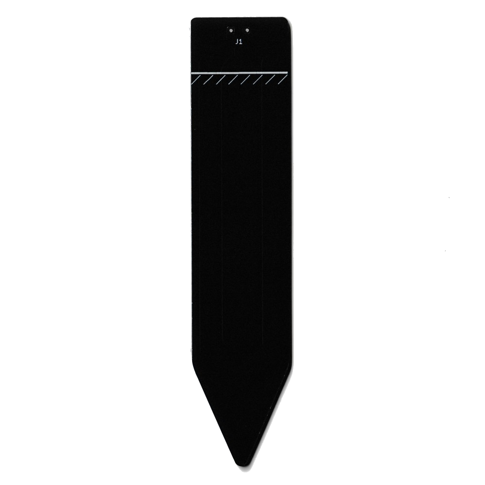
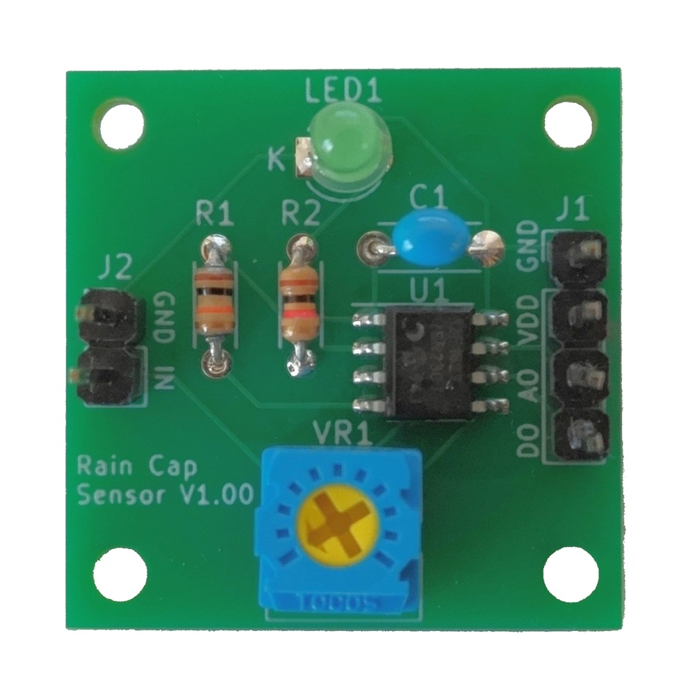

# 静電容量式土壌水分センサ基板
## 概要
静電容量式のレインセンサに付着した水滴を検出する基板です。 この基板だけで雨の検出はできませんので、別売の[静電容量式レインセンサ基板](https://naoto64.github.io/Capacitive-Rain-Sensor/)を使用します。

このセンサは静電容量式の土壌水分センサです。 地中の水分量に応じて、端子間の静電容量が変化します。その静電容量を読み取ることで、土壌水分を検出することができます。 このセンサは従来の抵抗式とは違い、電極が腐食しないため、長時間の屋外使用でも耐久性が上がります。 また、基板にIC等の電子部品が無いため、水による故障が起きにくくなります。
このセンサに電線は付属しておりませんので、別途ご用意ください。

## 使用方法
センサー上部にある端子に電線（1m以内推奨）はんだ付けをします。電線の片側に検出基板用の端子（QIコネクタ メス 2P）を圧着し、検出基板と接続します。極性はどちらでも構いません。

はんだ付けした端子に防水のためコーキング処理（シリコン等）をします。

センサの線まで地中に埋め、周囲をしっかりと固めて下さい。隙間があると検出できない場合があります。

## 購入
この製品は以下のサイトから購入できます。  
スイッチサイエンス - 静電容量式土壌水分センサ基板

#### お問い合わせフォーム
[製品に関するお問い合わせ](https://forms.gle/Fn5E3byABXJ8P5sbA)

## 製品画像

## 静電容量検出基板
この基板は静電容量値の検出回路が別途必要です。
別売で、このセンサにも対応している静電容量式レインセンサ検出基板があります。

[静電容量式レインセンサ検出基板](https://naoto64.github.io/Rain-Capacitance-Sensor/ "静電容量式レインセンサ検出基板")

