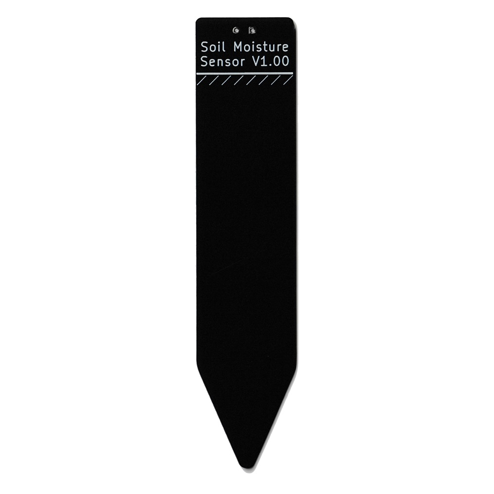

# 静電容量式土壌水分センサ基板
## 概要
このセンサは静電容量式の土壌水分センサです。 地中の水分量に応じて、端子間の静電容量が変化します。その静電容量を読み取ることで、土壌水分を検出することができます。 このセンサは従来の抵抗式とは違い、電極が腐食しないため、長時間の屋外使用でも耐久性が上がります。 また、基板にIC等の電子部品が無いため、水による故障が起きにくくなります。

## 製品画像

